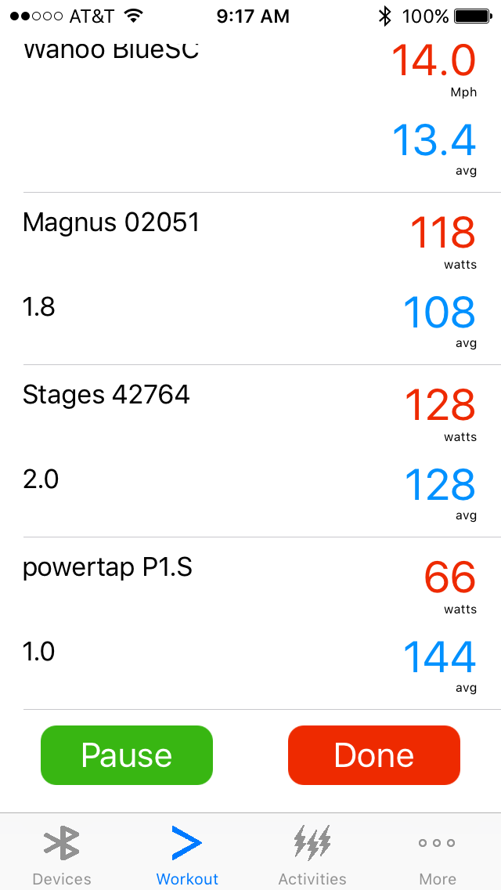
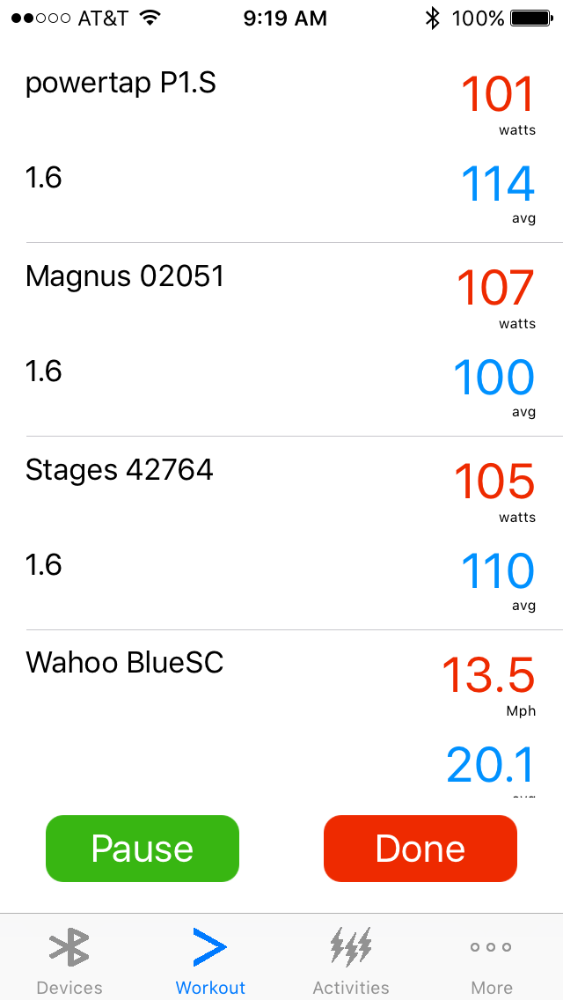

# wattdr

WattDr is a free utility for comparing bike power meters. It can connect to multiple power meters with bluetooth. Any power meter that follows the official specification should work. It has been tested ith Stages left-sided power meter, PowerTap P1S single sided pedal and Cycleops Magnus smart trainer.

The code for reading power meter will be open sourced so that others can use it and improve it.

<b>Data Export</b>

WattDr extends Garmin's TCX format with additional attributes to track multiple power meters and precise timestamps. Currently, the export supports JSON format. Other formats might be added in the future if enough people find it desirable. You should be able to load the JSON data with generic JSON parsers in Java, C# and Swift.

If you find a bug, please file a new issue. Thank you.

## Observations

Depending on the type of power meter, you will get different power readings. In general, pedal based power meters "may" register higher watt values than crank arm meters. Hub meters and smart trainers that do not use direct drive will have lower watt readings. To dive deeper into the complex topic of power meters, I recommend reading DC Rainmaker https://www.dcrainmaker.com/

