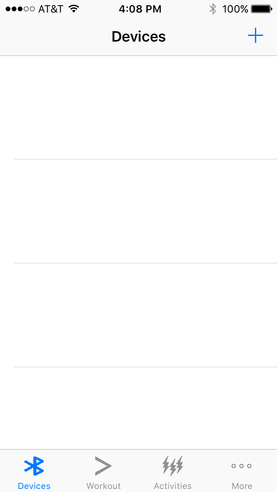
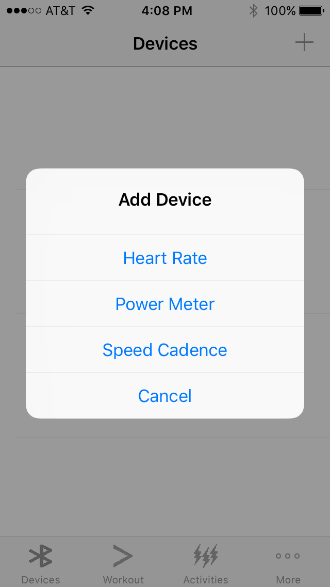
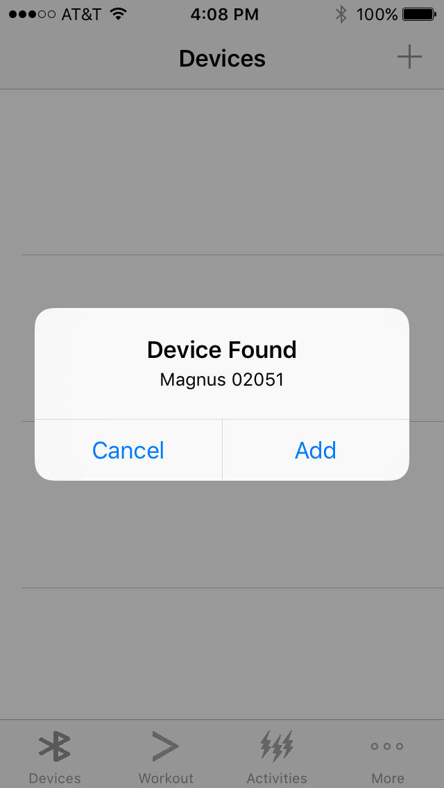
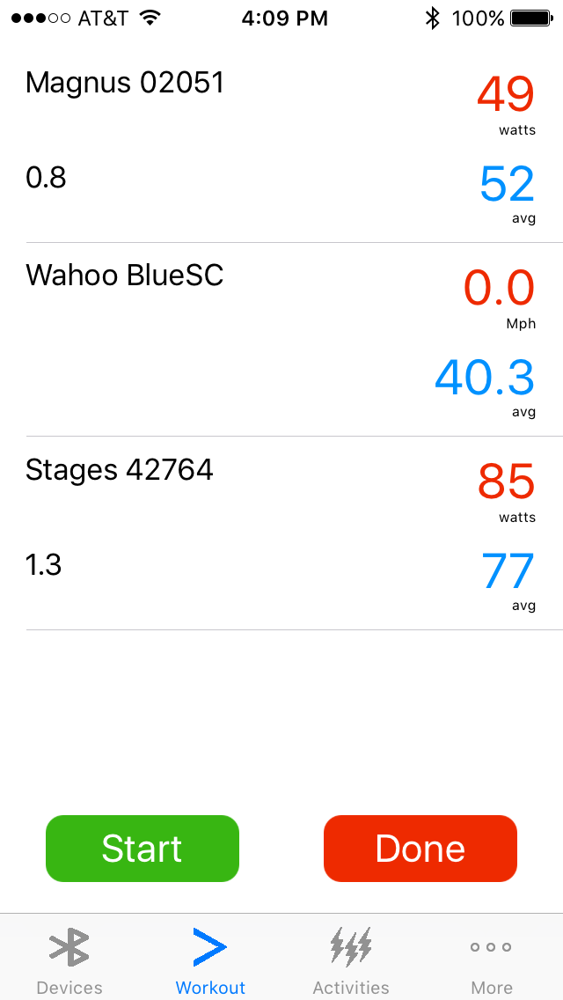
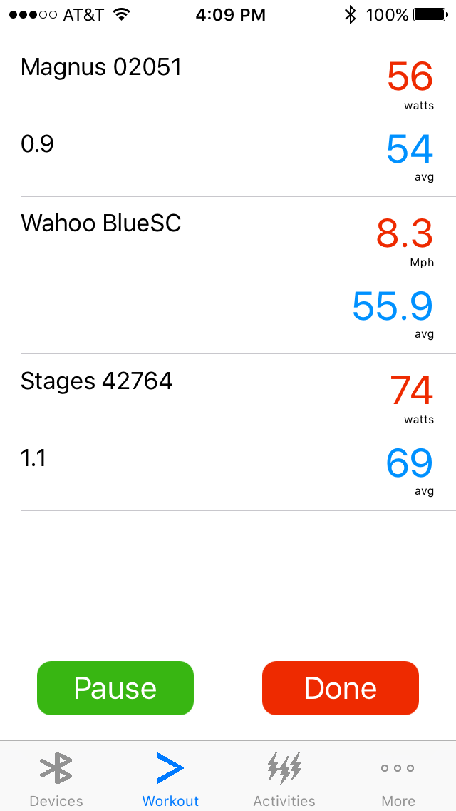
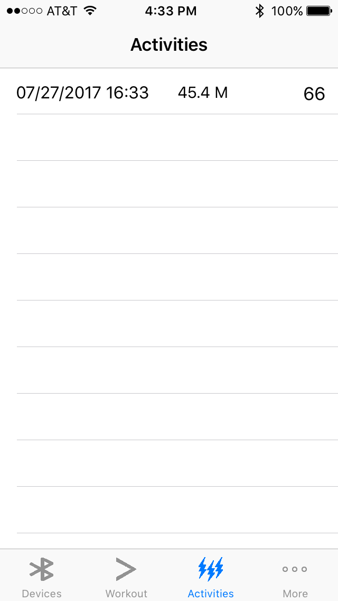
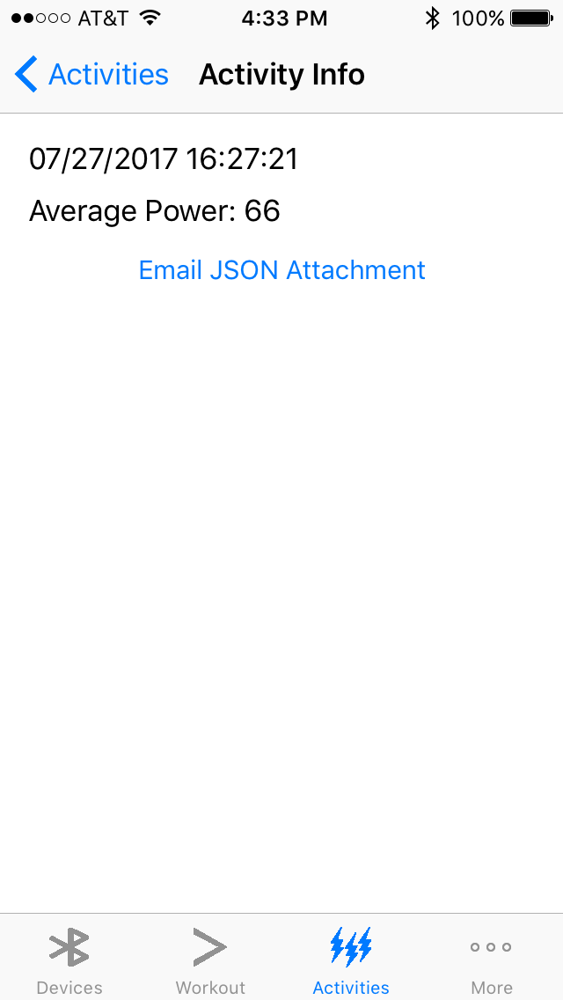
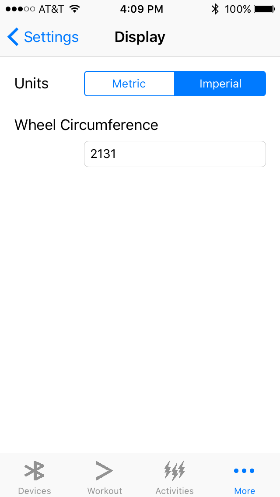
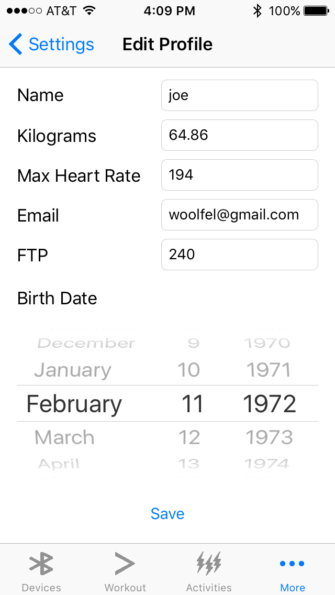
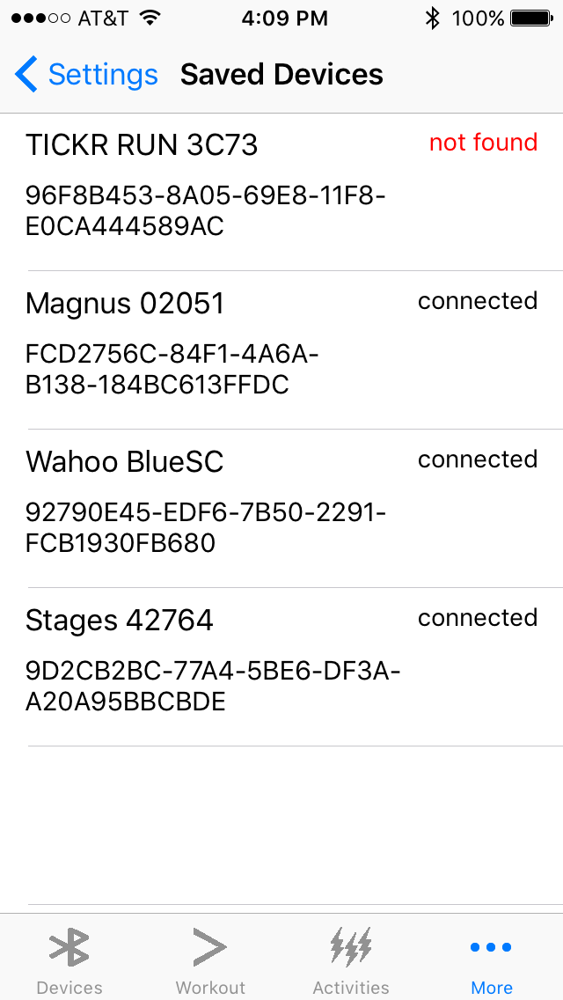

# Getting Started with WattDr
**Thank you for using WattDr**

If you're new to iOS Apps or bicycle power meters, here is a quick tutorial. First, you need a power meter that supports bluetooth LE. If you're not familiar with power meters, here are some popular products on the market today.

- https://www.powertap.com/page/pedals
- https://stagescycling.com/us/
- https://4iiii-innovations.myshopify.com/collections/power-meters

1. After you download WattDr, start the app

2. Tap the + button to pair a device.

3. Select Power Meter to pair a new power meter.
4. When it detects the power meter, it will ask you to add or cancel.

5. Tap Add to add the device. Repeat the process to add more power meters. You can add as many as you like.
6. Tap on the workout tab and start pedaling. It will show the current and average power.

7. To begin recording, tap Start button. After it starts, the start button will change to pause.

8. To end recording, tap done. It will save the workout session.
9. Tap activities to view the saved workout sessions.

10. Tap a row to email an export of the workout in JSON format. If you are not familiar with JSON format, please read the description on Wikipedia {https://en.wikipedia.org/wiki/JSON}

## Settings
WattDr can display the information in Imperial or Metric. To change the settings, tap on More and select display.

If you want to show the Watts/Kilogram, edit the profile and enter your weight in Kilograms.

To view the list of saved devices, go to more and saved devices

